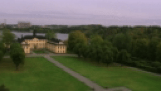

# Pixelization detection

| block size | image                                             |
| ---------- | ------------------------------------------------- |
| raw image  |   |
| 5px        |   |
| 10px       |  |
| 15px       |  |
| 25px       |  |
| 50px       |  |

## Analysis:

The following graph represents the variance of the laplacian over time for each block size:

